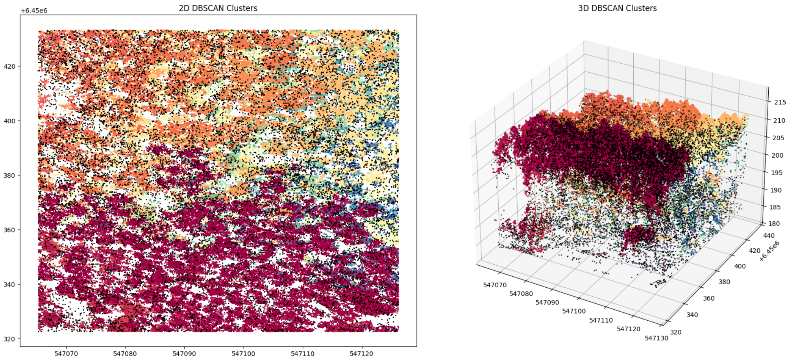
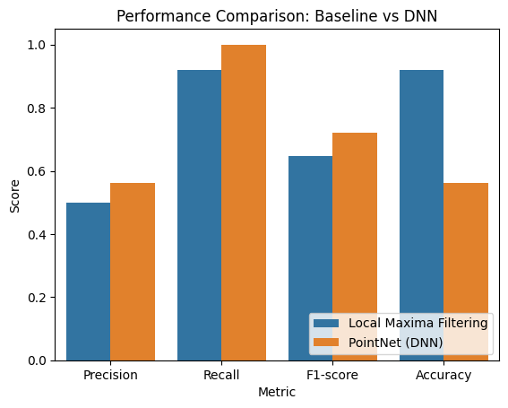

# LiDAR-Based Tree Detection in Mixed Forests 
## Use of DBSCAN for Outlier Detection and Dataset Cleaning

### Introduction

The primary task is to develop a pipeline for detecting individual trees from the LiDAR point
cloud data. The goal is to identify the locations of tree tops within the forest plots and compare
the detected trees with the ground truth field inventory data. 

The dataset is sourced from a UAV LiDAR survey and includes a dense point cloud (37
points/m²) covering a mixed and dense forest in Perm Krai, Russia. It also includes a field
inventory with 3600 trees recorded across 10 rectangular ground plots (100 m x 50 m). The
dataset provides:
• Point Cloud Data: Preprocessed LiDAR point clouds with height normalization (Z coordinate represents height above ground).
• Field Inventory Data:
o Tree species labels for all recorded trees.
o Diameter at breast height (DBH) for all trees.
o Tree height measurements for ~20% of trees.
o Tree age data for ~10% of trees.

### Methodology

**Approach**

- We used DBSCAN to preprocess the dataset by detecting and removing noise points. DBSCAN groups closely packed data points into clusters and labels low-density points as noise, effectively isolating outliers.

**Tools and Techniques**

- Libraries Used: _CUML_ for DBSCAN (GPU dedicated DBSCAN) and preprocessing, _Matplotlib_ for visualization, _tensorflow_ for Neural Network and _sklearn_ for splitting and choosing DBSCAN parameters.

- Preprocessing: There was a heihg threshold to choose trees with 170.

- Parameter Tuning: The eps and min_samples parameters of DBSCAN were optimized based on the Elbow method for DBSCAN.

**Steps**

- Height Threshold: Selected a height threshold of 170. 

- Clustering with DBSCAN: The algorithm was applied to identify clusters and noise points.

- Outlier Removal: Points labeled as noise (-1) were removed to clean the dataset.

- Visualization: Clusters and noise were visualized in 2D and 3D plots for validation.

- Local Maxima: Implementation of a given local maxima filter to detect local maxima in the point cloud with a fixed window size(2.0).

- Neural Network: Build a PointNet model with tensorflow with 2 classes for binary classification.

- Evaluate the results: Calculate and report key performance metrics.

- Comparison with baseline: Compare the DNN’s performance to the baseline local maxima filtering
algorithm.

### DBSCAN for outlier removal

DBSCAN works by grouping points that are closely packed together while marking points in sparse regions as outliers. The key parameters eps and min_samples define the neighborhood radius and the minimum points needed to form a cluster, respectively. Points with fewer than min_samples neighbors within the eps radius are labeled as noise.

Since the size dataset was big, the use of DBSCAN on the CPU was not possible, therefore the use of a dedicated library for running DBSCAN on the GPU was required.

The integration of DBSCAN for outlier removal was a critical step in the preprocessing pipeline, ensuring accurate and efficient tree detection. The methodology demonstrated the algorithm’s ability to enhance data quality and project outcomes.

The following limitations were found:

- Parameter sensitivity: The results depend heavily on the choice of eps and min_samples, requiring manual tuning.

- Computational cost: DBSCAN can be computationally expensive for very large datasets.

(outliers are shown in black color)

### Results

- DBSCAN effectively clustered meaningful data points while identifying noise as outliers.

- Outliers were successfully removed, leaving a clean dataset for further analysis.

- Cluster Visualization: Both 2D and 3D plots demonstrated clear separation between clusters and noise points.

- Filtered Data: Visualizations of the cleaned dataset showed only relevant clusters, ensuring the integrity of subsequent tree detection tasks.

- The algorithm performed well with the following parameters:

    - Epsilon (eps): 0.5

    -  Minimum Samples (min_samples): 4

| Algorithm                | Precision | Recall   | F1-score | Accuracy  |
|--------------------------|-----------|----------|----------|-----------|
| Local Maxima Filtering   | 0.498708  | 0.919048 | 0.646566 | 0.919048  |
| PointNet (DNN)           | 0.562760  | 1.000000 | 0.720213 | 0.562760  |
